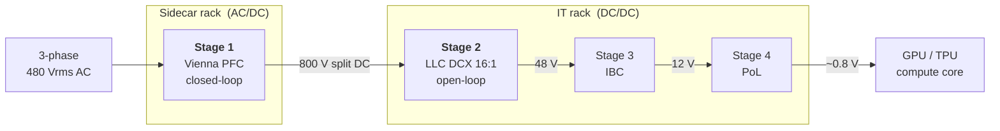

# AI Datacenter PSU - 800 V Power Architecture (Renesas Reference Design Build)

**A grid-to-core power conversion chain for AI datacenter racks: three-phase AC in, 800 V HVDC bus, down to the GPU core. Built on Renesas RA MCUs and GaN, as a system-design and firmware portfolio.**

> **What this is.** A working reproduction of the power architecture Renesas published in its
> October 2025 white paper *Power Architecture Evolution in Data Centers*. The goal is not to
> ship a product. It is to demonstrate the full engineering arc that a power firmware lead is
> expected to own: reading the topology, selecting the right Renesas silicon and justifying it,
> and writing the production-grade firmware that makes it run. Every choice in this repo is made
> the way it would be made on a real design, and the reasoning is written down.
>
> This is an independent learning and portfolio build. It is not an official Renesas deliverable.

---

## Contents

1. [Why 800 V, and why now](#1-why-800-v-and-why-now)
2. [The system architecture](#2-the-system-architecture)
3. [Why Renesas silicon, and why GaN is the bet](#3-why-renesas-silicon-and-why-gan-is-the-bet)
4. [The stages](#4-the-stages)
5. [Design rationale](#5-design-rationale)
6. [What this portfolio demonstrates](#6-what-this-portfolio-demonstrates)
7. [References](#references)

---

## 1. Why 800 V, and why now

AI training clusters have broken the old power budget. A rack that used to draw tens of
kilowatts now climbs past 100 kW and is heading toward the megawatt scale as GPU density grows.
That much power cannot be distributed at 48 V or 12 V without paying an enormous penalty in
copper and heat.

The physics is unforgiving. For a fixed delivered power, current scales inversely with bus
voltage (P = V x I), and conduction loss scales with the square of current (P_loss = I squared x R).
Raising the distribution bus from 48 V to 800 V cuts the current for the same power by roughly
16x, which cuts the I squared R loss in the bus bars by roughly 250x. The bus bars themselves
shrink, the copper bill drops, and the rack gets more efficient end to end.

That is why the industry is moving to **800 V HVDC distribution**, the direction behind NVIDIA's
800 VDC rack initiative and the Open Compute Project's evolving power specs. The high-voltage DC
bus is generated in a dedicated sidecar rack from the three-phase mains, then distributed as DC
into the IT rack, where a chain of step-down converters feeds the GPUs. This repo builds that
chain.

---

## 2. The system architecture

The full grid-to-core path. The two stages with their own repositories (Stage 1 and Stage 2) are
the ones built here; Stages 3 and 4 are shown for downstream context.

| Stage | Function | Voltage | Control | Repo |
|---|---|---|---|---|
| **1. Vienna PFC** | three-phase active rectifier, power factor correction | 480 Vac to 800 Vdc | closed-loop (control loop every PWM cycle) | [`ra6t2-vienna-pfc-fw`](https://github.com/Naveens-Lab/ra6t2-vienna-pfc-fw) |
| **2. LLC DCX** | isolated DC transformer, 16:1 step-down | 800 V to 48 V | open-loop (fixed resonant operation) | [`ra6t2-llc-dcx-fw`](https://github.com/Naveens-Lab/ra6t2-llc-dcx-fw) |
| 3. IBC | intermediate bus converter | 48 V to 12 V | (downstream context) | - |
| 4. PoL | point-of-load, vertical power delivery | 12 V to ~0.8 V | (downstream context) | - |

The split DC bus (two series capacitors making +400 V and -400 V around a neutral) is what makes
the Vienna stage a three-level converter. That neutral point is both an advantage (each device
blocks only half the bus) and a burden (it must be actively balanced in firmware). More on that
in the Stage 1 repo.

---

## 3. Why Renesas silicon, and why GaN is the bet

This architecture is a Renesas reference design because Renesas now has the full power chain in
silicon: GaN switches, REXFET MOSFETs, gate drivers, controllers, and the RA MCUs that run the
control. The headline enabler, and the part of the story worth understanding first, is the
**bidirectional GaN switch (BDS)**.

### The GaN BDS case

A Vienna rectifier needs a four-quadrant switch at each phase's neutral connection. The classic
way to build that is two back-to-back switches in series, which doubles the device count, the
conduction loss, and the gate-drive complexity. Renesas's GaN BDS collapses that into one
monolithic bidirectional device. The payoff in this topology:

- **One device instead of two.** Lower conduction loss and far less board area than the
  back-to-back arrangement.
- **Half the voltage stress.** In a three-level Vienna topology each switch only blocks about
  400 V of the 800 V bus, which is squarely in the GaN sweet spot.
- **Three floating HV drivers for the whole rectifier**, instead of one per series device.
- **Fast and clean switching.** GaN's high dv/dt (over 100 V/ns) and low gate charge cut
  switching loss, which is what lets the stage hit high power density at high efficiency.
- **Standard gate drive.** Renesas's SuperGaN devices switch without negative gate bias, so the
  driver stays simple.

GaN is not a checkbox here. It is the reason the topology is attractive at this power and voltage,
and selecting it deliberately (rather than defaulting to silicon or SiC) is the core silicon-level
decision of the AC/DC front end.

### Silicon map across the chain

| Role | Part | Why this part |
|---|---|---|
| Control MCU (both stages) | `R7FA6T2AD3CNE` (RA6T2) | Cortex-M33 with FPU, three-phase complementary GPT, fast ADC_B, ACMPHS comparators, POEG hardware fault path. Steps up to RA8T1 (M85 + Helium) only if the control loop becomes cycle-bound. |
| Stage 1 neutral-point switch x3 | `TP65B110HRU` GaN BDS | 650 V, 110 mΩ bidirectional SuperGaN. Replaces two back-to-back switches per phase (see above). |
| Stage 1 output rectifiers | SiC diodes | low reverse-recovery rectification onto the +/-400 V rails. |
| Stage 2 primary switch | `TP65H030G4PRS` GaN | 650 V, 30 mΩ half-bridge primary for the resonant tank. |
| Stage 2 synchronous rectifier | `RBE024N08R1SZN6` REXFET | 80 V, 2.4 mΩ low-side SR for the 48 V secondary. |
| Stage 2 SR gate driver | `HIP2211` | 100 V half-bridge driver. |
| Aux bias (both) | `iW1825` | 700 V flyback controller generating control-side bias from the HV bus. |
| Isolated gate drivers / current sense (Stage 1) | Renesas isolated parts | floating HV gate drive and isolated phase-current sensing (exact PNs pulled from the Winning Combination BOM). |

---

## 4. The stages

### Stage 1 - Vienna PFC
[`ra6t2-vienna-pfc-fw`](https://github.com/Naveens-Lab/ra6t2-vienna-pfc-fw)

A three-phase, three-level Vienna rectifier serving as the PFC front end. This is the
closed-loop stage: the firmware runs a complete control loop every PWM cycle. Sample the grid and
the inductor currents, lock a PLL to the grid angle, transform into the rotating d-q frame, run
nested PI loops, regenerate the modulation with space-vector PWM, and write the gate duties before
the next cycle. It closes three control objectives at once: input current shaping for near-unity
power factor (the PFC), 800 V bus regulation, and neutral-point balancing across the split bus.
The repo README walks through the concepts from zero, with animations, then the silicon, the
reference-design schematic, and the firmware design.

### Stage 2 - LLC DCX
[`ra6t2-llc-dcx-fw`](https://github.com/Naveens-Lab/ra6t2-llc-dcx-fw)

An isolated LLC resonant converter run as a DC transformer (DCX): a fixed 16:1 step-down from the
800 V bus to 48 V. This is the open-loop stage. Once configured, the silicon generates the gate
PWM autonomously at the resonant frequency; the only dynamic firmware is a soft-start frequency
sweep, plus ADC supervision and hardware overcurrent protection. It is the simpler stage and the
right place to start, which is why it was built first.

---

## 5. Design rationale

A few system-level choices worth calling out, because the "why" is the point of this repo:

- **Two conversion stages, not one.** A single direct 800 V to point-of-load converter is
  theoretically possible but impractical for regulation, isolation, and transient response.
  Splitting the job into a regulated AC/DC front end and an unregulated isolated DCX lets each
  stage be optimized for one thing, and is the structure the published architecture uses.
- **Three-level Vienna for the front end.** At 800 V, halving the per-switch voltage stress is
  worth the added control complexity (the neutral-point balancing). A two-level active front end
  would need higher-voltage, higher-loss devices.
- **Open-loop DCX for the isolated stage.** Running the LLC at its resonant point as a fixed-ratio
  transformer gives the highest efficiency and lets the regulation live in the front end, where it
  belongs. The DCX does not need to regulate, so it does not.
- **One MCU family across both stages.** Keeping both stages on the RA6T2 means one toolchain
  (e2 studio + FSP), one peripheral model (GPT, ADC_B, ACMPHS, POEG), and transferable firmware
  patterns. Toolchain parity is a real engineering cost saver, not an afterthought.

---

## 6. What this portfolio demonstrates

This project is structured to show the full scope of a power firmware lead, not just coding:

- **Topology literacy.** Reading a published reference architecture and understanding why each
  stage and each topology was chosen.
- **Silicon selection.** Picking the right Renesas devices for each role and being able to defend
  every choice, especially the GaN BDS decision at the heart of the front end.
- **System integration.** Connecting MCU peripherals, gate drivers, sensing, and protection into a
  coherent design with a clear pin map and a reference schematic.
- **Production-grade firmware.** Deterministic control ISRs, clean module boundaries, hardware
  fault paths, and a staged bench bring-up plan, written the way safety-relevant power firmware
  should be.

Start with the [Stage 1 repo](https://github.com/Naveens-Lab/ra6t2-vienna-pfc-fw) for the
closed-loop control story, or the [Stage 2 repo](https://github.com/Naveens-Lab/ra6t2-llc-dcx-fw)
for the open-loop resonant foundation.

---

## References

- Renesas, *Power Architecture Evolution in Data Centers* (white paper, October 2025):
  https://www.renesas.com/en/document/whp/power-architecture-evolution-data-centers
- Renesas, *3.6 kW Vienna Rectifier* reference design:
  https://www.renesas.com/en/applications/industrial/renewable-energy-grid/3-6kw-vienna-rectifier
- Renesas newsroom, *Renesas Powers 800 Volt Direct Current AI Data Center Architecture* (October 2025):
  https://www.renesas.com/en/about/newsroom/renesas-powers-800-volt-direct-current-ai-data-center-architecture-next-generation-power
- Open Compute Project, *Power Architecture Evolution in Data Centers* (OCP document):
  https://www.opencompute.org/documents/power-architecture-evolution-in-data-centers-pdf

---

*Built by [Naveens-Lab](https://github.com/Naveens-Lab) as a system-design and firmware portfolio
for power electronics work on the Renesas RA platform.*
